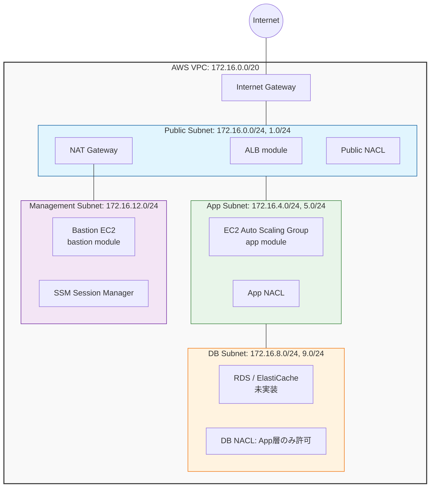

# terraform-mylab

AWS インフラを構築する Terraform モジュールのラボリポジトリ。
学習目的でありながら実環境で使えることを設計基準に置いている。

## アーキテクチャ概要



> DB 層（RDS / ElastiCache）はネットワーク設計（サブネット・NACL・SG）のみ用意しており、リソース自体は未実装。

## 設計方針

### CIDR 設計

VPC に `172.16.0.0/20` を採用している。`10.0.0.0/16` はデフォルト VPC や他環境と競合しやすいため、VPN・Peering を見据えて競合しにくい帯域を選定した。

`/20` に対して `cidrsubnet(vpc_cidr, 4, offset)` で `/24` サブネットを自動計算する。offset を変数で指定することで、手計算・入力ミスを構造的に排除している。

```
172.16.0.0/20  (VPC全体 = 4,096 アドレス)
├── offset 0–3   : Public     (0.0/24, 1.0/24, ...)
├── offset 4–7   : App        (4.0/24, 5.0/24, ...)
├── offset 8–11  : DB         (8.0/24, 9.0/24, ...)
└── offset 12–15 : Management（必要時のみ作成。offsetを指定しないと0個）
```

### 多層防御

| レイヤー | リソース | 役割 |
|---|---|---|
| サブネット境界 | NACL | ゾーン単位の粗いフィルタ。DB層はapp層のCIDRのみ許可 |
| インスタンス境界 | Security Group | ポート単位の細かい制御。SGのIDで連鎖させ、CIDR指定を排除 |
| ルーティング | Route Table | DB層はデフォルトルートなし（完全閉域）|

### コスト設計

| 設定 | lab | prd |
|---|---|---|
| NAT Gateway | Single（共有）| Per-AZ（AZ障害を局所化）|
| VPC Endpoint | S3 / DynamoDB（Gateway型 = 無料）| 同左 |
| Flow Logs 保持期間 | 7日 | 要件に応じて延長 |

## モジュール構成

環境固有の値（CIDR・タグ・接続先など）は `environments/<env>/` に置き、再利用可能なロジックは `modules/` にまとめる構成。

```
.
├── versions.tf                      # ルートのTerraform/Providerバージョン制約
├── .tflint.hcl                      # TFLint設定
├── .github/
│   ├── workflows/
│   │   ├── terraform-check.yml      # fmt -check / validate / TFLint / tfsec / Checkov
│   │   └── docs.yml                 # terraform-docs で modules/vpc/README.md を自動更新
│   └── dependabot.yml               # Actions・Providerバージョンの自動アップデートPR
│
├── environments/
│   └── lab/                         # lab環境のルートモジュール（terraform initする場所）
│       ├── backend.tf               # Terraform設定・S3バックエンド（LABアカウント取得後に有効化）
│       ├── provider.tf              # AWSプロバイダー設定（ap-northeast-1）
│       ├── locals.tf                # project / environment / common_tags 等
│       ├── vpc.tf                   # vpc モジュールの呼び出し（module.my_vpc）
│       ├── alb.tf                   # alb モジュールの呼び出し
│       ├── app.tf                   # app モジュールの呼び出し（EC2 + Auto Scaling）
│       ├── bastion.tf               # bastion モジュールの呼び出し
│       └── iam.tf                   # bastion用 SSM IAMロール・インスタンスプロファイル
│
└── modules/
    ├── vpc/
    │   ├── main.tf                  # VPC・サブネット定義
    │   ├── variables.tf             # 入力変数（全設定はここから）
    │   ├── outputs.tf               # 他モジュールへの公開値
    │   ├── igw.tf                   # Internet Gateway
    │   ├── nat.tf                   # NAT Gateway・EIP
    │   ├── route_tables.tf          # ルートテーブル（public / app / db / management）
    │   ├── nacl.tf                  # Network ACL（public / app / db）
    │   ├── sg.tf                    # Security Group（web / app / db / management）
    │   ├── endpoints.tf             # VPC Endpoint（S3 / DynamoDB, Gateway型）
    │   ├── flow_logs.tf             # VPC Flow Logs + IAM
    │   ├── versions.tf
    │   └── README.md                # terraform-docs による自動生成ドキュメント
    │
    ├── alb/
    │   ├── main.tf                  # ALB本体・SG・ターゲットグループ・HTTP/HTTPSリスナー
    │   ├── variables.tf
    │   ├── outputs.tf
    │   ├── versions.tf
    │   └── examples/sample_call.tf.bak
    │
    ├── app/
    │   ├── main.tf                  # Launch Template・ASG・スケーリングポリシー・IAM（EC2アプリ層）
    │   ├── variables.tf
    │   ├── outputs.tf
    │   ├── versions.tf
    │   └── examples/sample_call.tf.bak
    │
    └── bastion/
        ├── main.tf                  # 単体EC2（SSM Session Manager接続、鍵ペアなし）
        ├── variables.tf
        ├── outputs.tf
        └── versions.tf
```

## 使い方

`environments/lab/` が呼び出し例を兼ねたルートモジュール。以下は各モジュールの呼び出しの要点（詳細は `environments/lab/*.tf` を参照）。

### vpc モジュール（`environments/lab/vpc.tf`）

```hcl
module "my_vpc" {
  source = "../../modules/vpc"

  vpc_cidr = "172.16.0.0/20"
  vpc_name = "my-vpc"
  azs      = ["ap-northeast-1a", "ap-northeast-1c"]

  public_subnet_offsets = [0, 1]  # 172.16.0.0/24, 172.16.1.0/24
  app_subnet_offsets    = [4, 5]  # 172.16.4.0/24, 172.16.5.0/24
  db_subnet_offsets     = [8, 9]  # 172.16.8.0/24, 172.16.9.0/24

  enable_nat_gateway     = true
  single_nat_gateway     = true
  one_nat_gateway_per_az = false

  enable_s3_endpoint       = true
  enable_dynamodb_endpoint = true

  project     = local.project
  environment = local.environment
  tags        = local.common_tags
}
```

管理層サブネット（踏み台用）を使う場合は `management_subnet_offsets`（例: `[12, 13]`）を追加で指定する。現在の `vpc.tf` では未指定のため、`bastion` モジュールを実際にデプロイする前にこの変数を設定する必要がある（後述の TODO 参照）。

EKS を使う場合は `enable_eks = true` と `eks_cluster_name` を指定すると、public サブネットに `kubernetes.io/role/elb`、app サブネットに `kubernetes.io/role/internal-elb` タグが自動付与される。

### alb モジュール（`environments/lab/alb.tf`）

`vpc` モジュールの出力（`vpc_id` / `public_subnet_ids`）と `app` モジュールの出力（`security_group_id`）を受け取り、ALB本体・SG・ターゲットグループ・HTTP→HTTPSリダイレクトリスナーを作成する。ACM証明書・アクセスログ用S3バケットは事前に用意しておく前提（`locals.tf` の `alb_acm_arn` / `alb_logs_bucket` を参照）。

```hcl
module "alb" {
  source = "../../modules/alb"

  vpc_id              = module.vpc.vpc_id
  public_subnet_ids   = module.vpc.public_subnet_ids
  app_sg_id           = module.app_compute.security_group_id
  acm_certificate_arn = local.alb_acm_arn
  access_logs_bucket  = local.alb_logs_bucket

  target_port        = 8080
  health_check_path  = "/health"
  tags               = local.common_tags
}
```

### app モジュール（`environments/lab/app.tf`）

Launch Template + Auto Scaling Group + CPU使用率ベースのスケーリングポリシーで構成されたEC2アプリ層。IAMロール（SSM + CloudWatchAgent）はモジュール内で自動作成、または既存の `iam_instance_profile_arn` を渡して差し替え可能。

```hcl
module "app_compute" {
  source = "../../modules/app"

  env     = local.environment
  project = local.project

  vpc_id     = module.vpc.vpc_id
  subnet_ids = module.vpc.private_subnet_ids  # 2つ以上のAZ

  alb_security_group_id = module.alb.security_group_id
  target_group_arns     = [module.alb.target_group_arn]

  tags = local.common_tags
}
```

インスタンスタイプ・AMI・ストレージ・ASGサイズ・スケーリング閾値・ユーザーデータなど詳細を明示指定する場合は `modules/app/variables.tf` を参照。

### bastion モジュール（`environments/lab/bastion.tf`）

SSM Session Manager経由で接続する踏み台EC2。SSHキーは持たない。management層サブネットに配置するため、事前に `vpc` モジュール側で `management_subnet_offsets` を1つ以上指定しておく必要がある。IAMインスタンスプロファイルは `iam.tf` で作成したSSM用ロールを使用する。

```hcl
module "bastion" {
  source = "../../modules/bastion"

  instance_name = "${local.project}-${local.environment}-bastion"
  instance_type = "t3.micro"

  subnet_id          = module.my_vpc.management_subnet_ids[0]
  security_group_ids = [module.my_vpc.management_sg_id]

  iam_instance_profile_name = aws_iam_instance_profile.ssm.name

  tags = local.common_tags
}
```

### 本番環境（AZ 冗長構成）を作る場合

`vpc` モジュール呼び出しで以下を切り替える。

```hcl
enable_nat_gateway     = true
single_nat_gateway     = false
one_nat_gateway_per_az = true
```

## 主な変数（vpc モジュール）

他モジュール（alb / app / bastion）の変数は各 `modules/<name>/variables.tf` を参照。

| 変数 | 型 | デフォルト | 説明 |
|---|---|---|---|
| `vpc_cidr` | `string` | `172.16.0.0/20` | VPC の CIDR ブロック |
| `vpc_name` | `string` | 必須 | VPC 名（全リソース名の接頭辞）|
| `azs` | `list(string)` | 必須 | 使用するアベイラビリティゾーン |
| `public_subnet_offsets` | `list(number)` | `[0, 1]` | パブリックサブネットの offset |
| `app_subnet_offsets` | `list(number)` | `[4, 5]` | アプリ層サブネットの offset |
| `db_subnet_offsets` | `list(number)` | `[8, 9]` | DB 層サブネットの offset |
| `management_subnet_offsets` | `list(number)` | `[]` | 管理層サブネットの offset（空なら未作成。bastion モジュールを使う場合は指定必須）|
| `enable_nat_gateway` | `bool` | `false` | NAT Gateway の作成有無 |
| `single_nat_gateway` | `bool` | `true` | NAT Gateway を全 AZ で共有するか |
| `one_nat_gateway_per_az` | `bool` | `false` | AZ ごとに NAT Gateway を作成するか |
| `enable_s3_endpoint` | `bool` | `false` | S3 Gateway Endpoint の作成有無 |
| `enable_dynamodb_endpoint` | `bool` | `false` | DynamoDB Gateway Endpoint の作成有無 |
| `enable_eks` | `bool` | `false` | EKS 用サブネットタグの付与有無 |
| `eks_cluster_name` | `string` | `""` | EKS クラスター名（`enable_eks=true` 時に必須）|
| `environment` | `string` | 必須 | 環境名（例: `lab` / `prd`）|
| `project` | `string` | 必須 | プロジェクト名（タグ・リソース名に使用）|
| `flow_log_retention_days` | `number` | `7` | Flow Logs の保持期間（日）|
| `tags` | `map(string)` | `{}` | 全リソースに付与する共通タグ |

## 主な出力値（vpc モジュール）

| 出力 | 説明 |
|---|---|
| `vpc_id` | VPC の ID |
| `vpc_cidr_block` | VPC の CIDR |
| `public_subnet_ids` | パブリックサブネット ID のリスト |
| `app_subnet_ids` | アプリ層サブネット ID のリスト |
| `db_subnet_ids` | DB 層サブネット ID のリスト |
| `management_subnet_ids` | 管理層サブネット ID のリスト（未指定時は空リスト）|
| `public_route_table_id` / `app_route_table_ids` / `db_route_table_ids` / `management_route_table_ids` | 各層のルートテーブル ID |
| `web_sg_id` | ALB / Web 用 Security Group の ID |
| `app_sg_id` | アプリ層用 Security Group の ID |
| `db_sg_id` | DB 層用 Security Group の ID |
| `management_sg_id` | 管理層用 Security Group の ID |

alb / app / bastion モジュールの出力（ALB DNS名、ターゲットグループARN、ASG名、インスタンスIDなど）は各 `modules/<name>/outputs.tf` を参照。

## CI / CD

| ワークフロー | トリガー | 内容 |
|---|---|---|
| `terraform-check.yml` | push / PR (main) | `fmt -check -recursive` + `validate` + TFLint（AWSルールセット）+ tfsec（soft-fail）+ Checkov（soft-fail）|
| `docs.yml` | PR → main | `terraform-docs` で `modules/vpc/README.md` を自動更新・自動コミット |
| `dependabot.yml` | 日次 | GitHub Actions・Terraformプロバイダーのバージョンアップデート PR |

## Requirements

| ツール | バージョン | 備考 |
|---|---|---|
| Terraform | `>= 1.6.0`（ルート `versions.tf`）| `environments/lab/backend.tf` は `>= 1.5` を指定しており記述が揺れているため統一が望ましい |
| AWS Provider | `>= 5.30.0`（ルート・各モジュール共通）| `environments/lab/backend.tf` のみ `~> 6.0` を指定しており記述が揺れているため統一が望ましい |
| AWS CLI | 認証情報が設定済みであること | |

## TODO

- [ ] S3 バックエンドの有効化（LAB アカウント取得後）
- [ ] DynamoDB によるステートロックの確認
- [ ] `environments/lab/backend.tf` の Terraform / AWS Provider バージョン制約をルート `versions.tf` に合わせて統一する
- [ ] `bastion` モジュールを実際に使う前に `vpc.tf` へ `management_subnet_offsets` を追加する（未設定だと `management_subnet_ids` が空でエラーになる）
- [ ] DB層（RDS / ElastiCache）モジュールの実装
