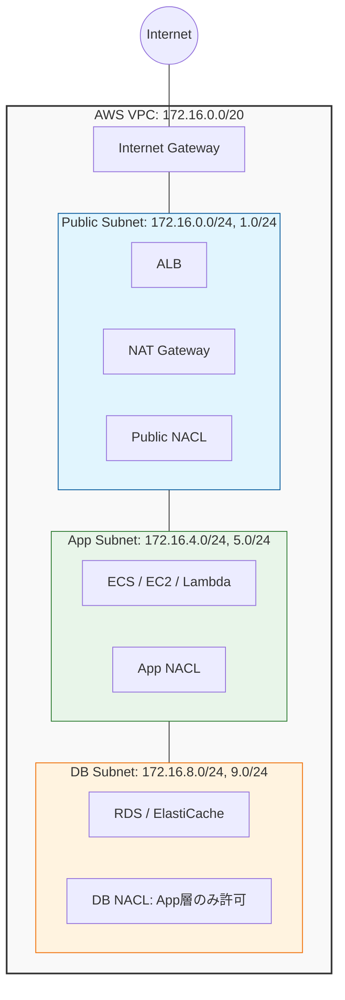

# terraform-mylab

AWS VPC を構築する Terraform モジュールのラボリポジトリ。
学習目的でありながら、そのまま実環境で使えることを設計基準に置いている。

## アーキテクチャ概要



## 設計方針

### CIDR 設計

VPC に `172.16.0.0/20` を採用している。`10.0.0.0/16` はデフォルト VPC や他環境と競合しやすいため、VPN・Peering を見据えて競合しにくい帯域を選定した。

`/20` に対して `cidrsubnet(vpc_cidr, 4, offset)` で `/24` サブネットを自動計算する。offset を変数で指定することで、手計算・入力ミスを構造的に排除している。

```
172.16.0.0/20  (VPC全体 = 4,096 アドレス)
├── offset 0–3   : Public     (0.0/24, 1.0/24, ...)
├── offset 4–7   : App        (4.0/24, 5.0/24, ...)
├── offset 8–11  : DB         (8.0/24, 9.0/24, ...)
└── offset 12–15 : Management（必要時のみ作成）
```

### 多層防御

| レイヤー | リソース | 役割 |
|---|---|---|
| サブネット境界 | NACL | ゾーン単位の粗いフィルタ。DB層はapp層のCIDRのみ許可 |
| インスタンス境界 | Security Group | ポート単位の細かい制御。SGのIDで連鎖させ、CIDR指定を排除 |
| ルーティング | Route Table | DB層はデフォルトルートなし（完全閉域）|

### コスト設計

| 設定 | lab | prd |
|---|---|---|
| NAT Gateway | Single（共有）| Per-AZ（AZ障害を局所化）|
| VPC Endpoint | S3 / DynamoDB（Gateway型 = 無料）| 同左 |
| Flow Logs 保持期間 | 7日 | 要件に応じて延長 |

## モジュール構成

```
.
├── main.tf                  # ルート: プロバイダー・モジュール呼び出し
└── modules/
    └── vpc/
        ├── main.tf          # VPC・サブネット定義
        ├── variables.tf     # 入力変数（全設定はここから）
        ├── outputs.tf       # 他モジュールへの公開値
        ├── igw.tf           # Internet Gateway
        ├── nat.tf           # NAT Gateway・EIP
        ├── route_tables.tf  # ルートテーブル（全層）
        ├── nacl.tf          # Network ACL（public / app / db）
        ├── sg.tf            # Security Group（web / app / db）
        ├── endpoints.tf     # VPC Endpoint（S3 / DynamoDB）
        ├── flow_logs.tf     # VPC Flow Logs + IAM
        └── versions.tf      # Provider バージョン制約
```

## 使い方

### 基本（ラボ環境）

```hcl
module "my_vpc" {
  source = "./modules/vpc"

  vpc_cidr = "172.16.0.0/20"
  vpc_name = "my-vpc"
  azs      = ["ap-northeast-1a", "ap-northeast-1c"]

  public_subnet_offsets    = [0, 1]  # 172.16.0.0/24, 172.16.1.0/24
  app_subnet_offsets       = [4, 5]  # 172.16.4.0/24, 172.16.5.0/24
  db_subnet_offsets        = [8, 9]  # 172.16.8.0/24, 172.16.9.0/24

  enable_nat_gateway       = true
  single_nat_gateway       = true
  enable_s3_endpoint       = true
  enable_dynamodb_endpoint = true

  environment = "lab"
  project     = "mylab"
}
```

### EKS を使う場合

```hcl
module "my_vpc" {
  source = "./modules/vpc"
  # ...基本設定...

  enable_eks       = true
  eks_cluster_name = "my-cluster"
  # public サブネット → kubernetes.io/role/elb = "1" が付与される
  # app サブネット   → kubernetes.io/role/internal-elb = "1" が付与される
}
```

### 管理層サブネット（踏み台・CI/CD ランナー）を追加する場合

```hcl
module "my_vpc" {
  source = "./modules/vpc"
  # ...基本設定...

  management_subnet_offsets = [12, 13]  # 172.16.12.0/24, 172.16.13.0/24
}
```

### 本番環境（AZ 冗長構成）

```hcl
module "my_vpc" {
  source = "./modules/vpc"
  # ...基本設定...

  enable_nat_gateway     = true
  single_nat_gateway     = false
 origin/main
  one_nat_gateway_per_az = true
}
```

## 主な変数

| 変数 | 型 | デフォルト | 説明 |
|---|---|---|---|
| `vpc_cidr` | `string` | `172.16.0.0/20` | VPC の CIDR ブロック |
| `vpc_name` | `string` | 必須 | VPC 名（全リソース名の接頭辞）|
| `azs` | `list(string)` | 必須 | 使用するアベイラビリティゾーン |
| `public_subnet_offsets` | `list(number)` | `[0, 1]` | パブリックサブネットの offset |
| `app_subnet_offsets` | `list(number)` | `[4, 5]` | アプリ層サブネットの offset |
| `db_subnet_offsets` | `list(number)` | `[8, 9]` | DB 層サブネットの offset |
| `management_subnet_offsets` | `list(number)` | `[]` | 管理層サブネットの offset（空なら未作成）|
| `enable_nat_gateway` | `bool` | `false` | NAT Gateway の作成有無 |
| `single_nat_gateway` | `bool` | `true` | NAT Gateway を全 AZ で共有するか |
| `one_nat_gateway_per_az` | `bool` | `false` | AZ ごとに NAT Gateway を作成するか |
| `enable_s3_endpoint` | `bool` | `false` | S3 Gateway Endpoint の作成有無 |
| `enable_dynamodb_endpoint` | `bool` | `false` | DynamoDB Gateway Endpoint の作成有無 |
| `enable_eks` | `bool` | `false` | EKS 用サブネットタグの付与有無 |
| `eks_cluster_name` | `string` | `""` | EKS クラスター名（`enable_eks=true` 時に必須）|
| `environment` | `string` | 必須 | 環境名（`dev` / `stg` / `prd` / `lab`）|
| `project` | `string` | 必須 | プロジェクト名（タグ・リソース名に使用）|
| `flow_log_retention_days` | `number` | `7` | Flow Logs の保持期間（日）|

## 主な出力値

| 出力 | 説明 |
|---|---|
| `vpc_id` | VPC の ID |
| `vpc_cidr_block` | VPC の CIDR |
| `public_subnet_ids` | パブリックサブネット ID のリスト |
| `app_subnet_ids` | アプリ層サブネット ID のリスト |
| `db_subnet_ids` | DB 層サブネット ID のリスト |
| `web_sg_id` | ALB / Web 用 Security Group の ID |
| `app_sg_id` | アプリ層用 Security Group の ID |
| `db_sg_id` | DB 層用 Security Group の ID |

## CI / CD

| ワークフロー | トリガー | 内容 |
|---|---|---|
| `terraform-check.yml` | push / PR | `terraform fmt -check` + `terraform validate` |
| `docs.yml` | PR → main | `terraform-docs` で `modules/vpc/README.md` を自動更新 |
| `dependabot.yml` | 週次 | Provider バージョンの自動アップデート PR |

## Requirements

| ツール | バージョン |
|---|---|
| Terraform | `>= 1.5` |
| AWS Provider | `~> 6.0` |
| AWS CLI | 認証情報が設定済みであること |

## TODO

- [ ] S3 バックエンドの有効化（LAB アカウント取得後）
- [ ] DynamoDB によるステートロックの確認
